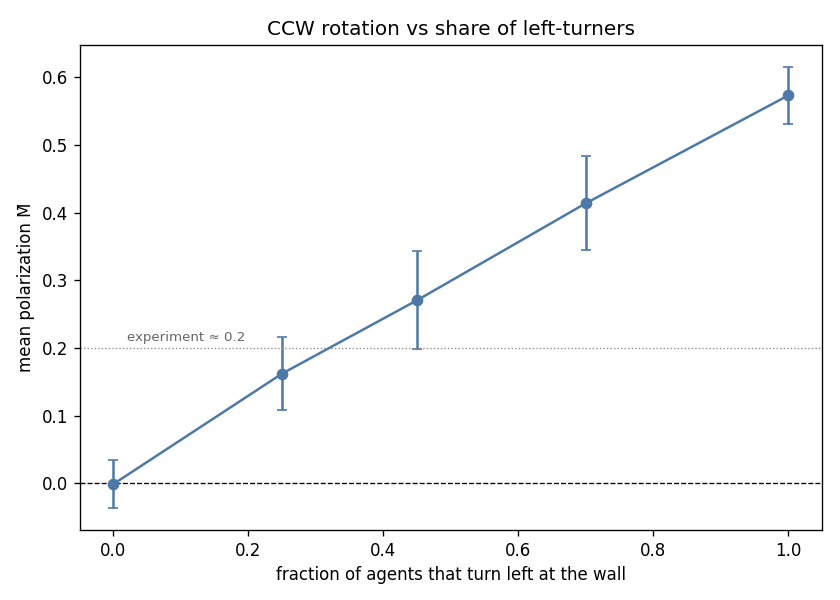
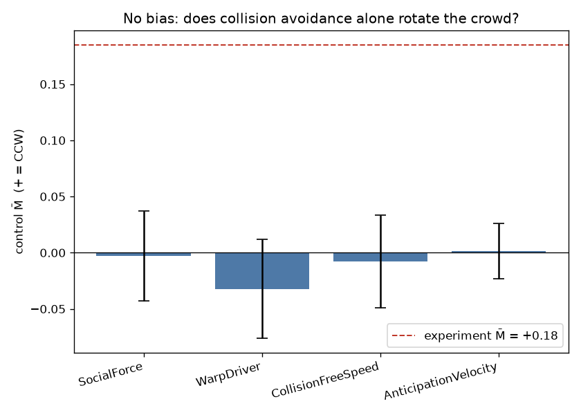
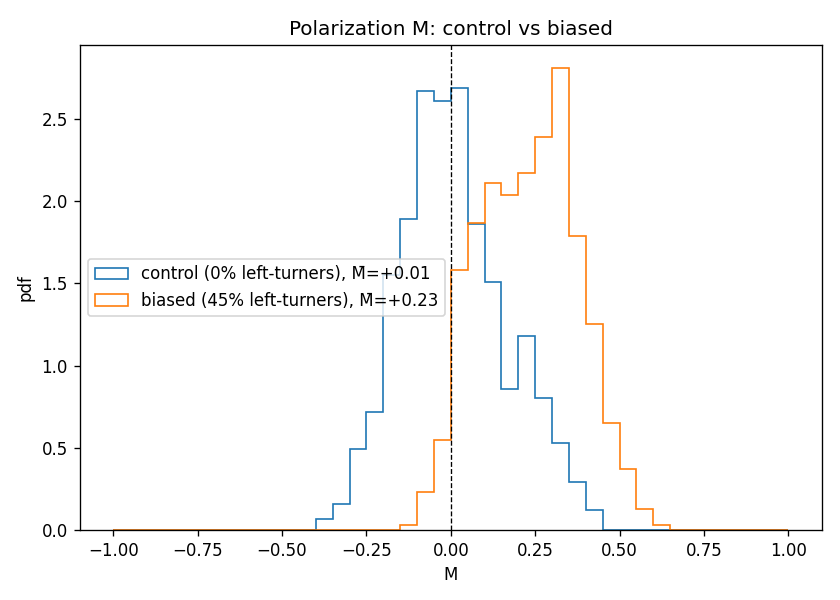
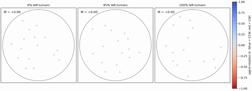
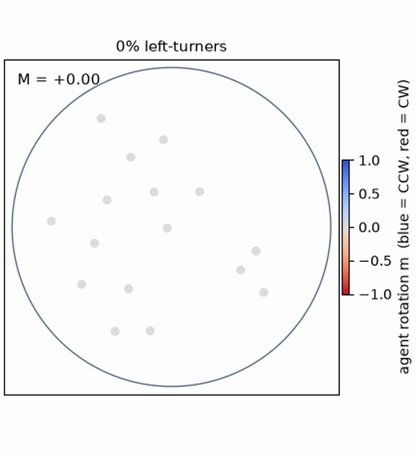
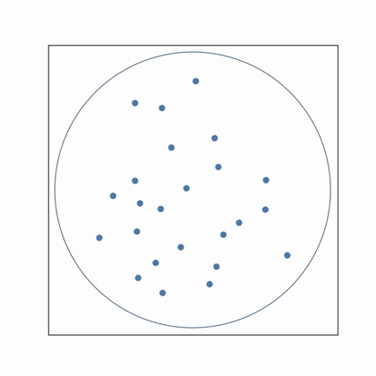
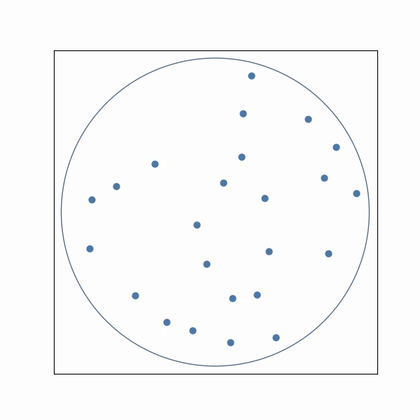
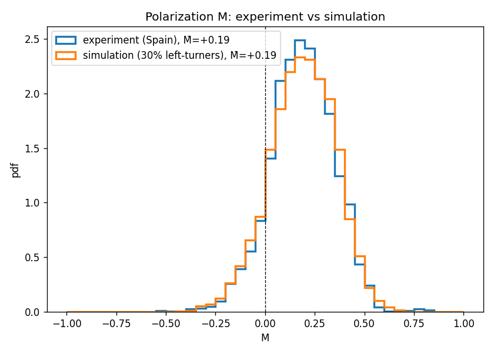
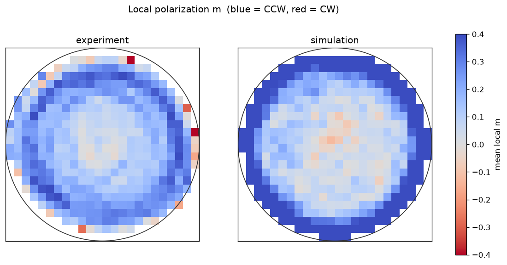
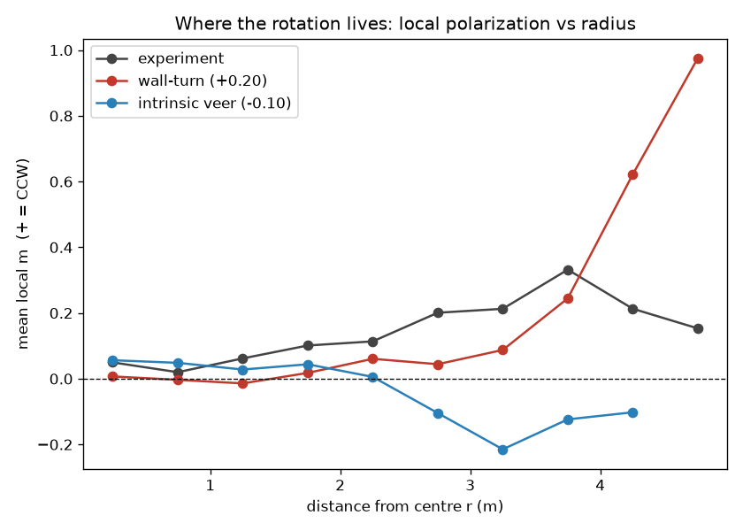

# clockwise — does counterclockwise crowd motion emerge in JuPedSim?

A model-based test, using [JuPedSim](https://www.jupedsim.org/), of the claim by Echeverría-Huarte et
al. (2026) that the spontaneous **counterclockwise (CCW) rotation** of a freely roaming crowd comes
from an **individual locomotor bias**, not from pedestrian interactions.

> Status: design complete, implementation pending. Results below are placeholders to be filled in as
> the study runs. See `docs/design.md` for the full design and `materials/` for the source paper and data.

## The phenomenon

When people roam freely inside a confined circular arena, the crowd drifts counterclockwise. The paper
measures this with a polarization parameter `M`: each person's velocity projected onto the
counterclockwise (azimuthal) direction around the arena centre, averaged over the crowd. `M̄ > 0` is
CCW; the experiments find a robust `M̄ ≈ 0.2`. The authors argue this is **not** an emergent effect of
people avoiding each other — it persists even for a person walking alone — but a slight per-person
**left-turn bias**.

## The question

JuPedSim's operational models are pure *interaction* models: agents avoid collisions but have **no
built-in turning bias**. That makes the simulator a clean testbed:

- **Control** — agents roam with collision avoidance and a **symmetric** wall response (turn toward
  the centre). If the paper is right, no CCW rotation should appear (`M̄ ≈ 0`).
- **Biased** — give agents the paper's proposed individual bias: **turn left when facing the wall**. If
  the mechanism is right, a CCW rotation should appear (`M̄ > 0`, near the experimental `≈ 0.2` for a
  calibrated turn strength).

## The model and our decisions

- **Arena:** a walkable disk of radius 5 m (matching the Spanish experiment), no internal obstacles.
- **Roaming:** each agent follows a heading that random-walks (unbiased wander). Near the rim it turns
  away from the wall — **symmetrically toward the centre** in the control, or **left (CCW)** in the
  biased condition. Agents are moved by JuPedSim **direct steering** toward a point just ahead of them
  (clamped to stay inside the disk).
- **Interactions:** collision avoidance is handled by the **Anticipation Velocity Model (AVM)**,
  JuPedSim's richest lateral-avoidance model — so "no CCW from symmetric avoidance" is a strong result.
- **Where the bias lives:** we try the individual bias in two places. (a) **Wall response** — turn left
  only when facing a wall; a calibration spike confirmed a symmetric wall-turn gives `M̄ ≈ 0` while a
  leftward one gives a strong `M̄ > 0`, so this is a single knob (`biased_fraction`) cleanly separated
  from the collective (AVM) avoidance. (b) **Free-space veer** — a constant leftward curvature applied
  every step (`free_curvature`), the paper's "intrinsic" reading. We compare both against the
  experiment's spatial field below; they fail in different, informative ways.
- **Metric:** `M(t)` exactly as in the paper (azimuthal projection of each agent's velocity, averaged),
  with `M̄` the time average after a warm-up.
- **Conditions:** control (symmetric) vs biased (turn-left-at-wall), at crowd sizes `N ∈ {16, 24, 32}`,
  several seeds each.
- **One calibrated parameter:** the leftward wall-turn strength, tuned so the biased case lands near
  `M̄ ≈ 0.2`; we report its value. The headline result is the *qualitative* contrast, not a fitted
  number.

**Scope (honest):** this reproduces the **confined-arena** CCW via the wall-turn mechanism. The paper
also finds CCW *without* boundaries and for lone walkers, which a wall-turn model does not explain — so
we test the paper's confined/wall hypothesis specifically, not its full claim. Full rationale and risks
are in `docs/design.md`.

## Results

5 m arena, `N ∈ {16, 24, 32}`, 10 seeds per point. (Reproduce with
`python -m clockwise --fractions 0.0 0.25 0.45 0.7 1.0 --sizes 16 24 32 --seeds 10 --out docs/results`.)

**1. Symmetric avoidance gives no rotation; a left-turn-at-wall bias does.** With nobody biased the
crowd does not rotate (`M̄ ≈ 0` at every size); as the share of left-turners grows, `M̄` rises
monotonically. A share of ~35 % reproduces the experiment's `M̄ ≈ 0.2`; if everyone turns left, the
rotation is much stronger (`M̄ ≈ 0.57`).

| share of left-turners | mean M̄ (N=16) | (N=24) | (N=32) |
|-----------------------|---------------|--------|--------|
| 0 % (control)         | −0.01         | 0.00   | 0.00   |
| 25 %                  | 0.16          | 0.17   | 0.16   |
| 45 %                  | 0.28          | 0.27   | 0.26   |
| 70 %                  | 0.46          | 0.37   | 0.40   |
| 100 %                 | 0.61          | 0.58   | 0.53   |



**The flat control is not specific to one model.** The avoidance is symmetric in *every* JuPedSim
operational model, so the no-bias control should be flat in all of them — not just AVM. Running the
control through SocialForceModel, WarpDriver, CollisionFreeSpeedModel and AnticipationVelocityModel,
each lands within `±0.03` of zero, far below the experimental `M̄ = +0.185`. The rotation is not a
property of any particular collision model; it has to be put in.



Reproduce with `python scripts/compare_models.py`.

**2. The polarization distribution shifts CCW, as in the paper's Fig 2.** The control `M(t)` is centred
on zero; with 45 % left-turners it shifts to `M̄ ≈ +0.23`.



**3. The rotation is visible.** Three crowds side by side as the share of left-turners increases — the
control mills without a net sense; with more left-turners the crowd circulates counterclockwise:



Individual cases (full-quality MP4s in `docs/results/`):

| 0% — control (`M̄ ≈ 0`) | 45% — ≈ paper (`M̄ ≈ 0.28`) | 100% (`M̄ ≈ 0.62`) |
|---|---|---|
|  |  |  |

**What this shows.** JuPedSim's collision avoidance is symmetric and produces no preferred rotation;
adding the paper's proposed individual bias — turning left when facing a wall — is sufficient to make a
confined crowd rotate counterclockwise, and the magnitude is set by how common that bias is in the
population. This matches the paper's confined-arena result. It does **not** address the paper's
boundary-free and lone-walker findings (see *Scope* above) — a wall-turn mechanism cannot.

## Validation against the experimental data

The authors' trajectory files include a per-agent polarization column (`Pol`). Recomputing it from
their `(X, Y, VX, VY)` with our metric matches **exactly** (max difference 0.0000, correlation 1.0
across every Spanish trial), so our `M` is identical to theirs. Pooled over all Spanish trials the
experimental `M̄ = +0.185`. Choosing the share of left-turners so the simulated `M̄` matches (≈ 30 %),
the full `M` *distribution* — not just the mean — closely coincides with the experiment:



Reproduce with `python scripts/validate_against_data.py` (needs `materials/ExperimentalData/` unzipped).

### Where the rotation lives — and two ways a minimal model fails

Matching the mean `M̄` is not the same as matching the mechanism. Their analysis code lets us go further
and ask *where* in the arena the rotation happens, by mapping the mean local `m` over space (the paper's
Fig 3 idea). We compare the experiment with **two** minimal models:

- **wall-turn** — a share of agents turn left only when facing the wall (the model calibrated above; `M̄`
  matches the experiment by construction).
- **intrinsic veer** — every agent has a faithful, constant **left** veer applied at every step (the
  "individual locomotor bias" the paper proposes; ref. 37, *walking straight into circles*), with a
  symmetric wall response. We report what this actually does, not a tuned match.



(The colour scale is clipped at ±0.4 for visibility; the wall-turn rim actually reaches `m ≈ 0.98`, far
past the clip — see the profile below.)



Mean local `m` per ring (distance `r` from the centre, in metres):

| r (m) | experiment | wall-turn | intrinsic veer |
|------:|:----------:|:---------:|:--------------:|
| 0.25  | +0.05 | +0.01 | +0.06 |
| 0.75  | +0.02 | −0.00 | +0.05 |
| 1.25  | +0.06 | −0.01 | +0.03 |
| 1.75  | +0.10 | +0.02 | +0.04 |
| 2.25  | +0.11 | +0.06 | +0.01 |
| 2.75  | +0.20 | +0.04 | −0.10 |
| 3.25  | +0.21 | +0.09 | −0.21 |
| 3.75  | +0.33 | +0.24 | −0.12 |
| 4.25  | +0.21 | +0.62 | −0.10 |
| 4.75  | +0.15 | +0.98 |  n/a  |
| **M̄** | **+0.185** | **+0.203** | **−0.097** |

(The intrinsic model's outermost ring is empty — the symmetric wall response keeps agents off the very
rim.)

The experiment shows a **coherent counterclockwise rotation that fills the disk**: positive at every
radius, building from a faint core to a peak in the outer-middle (`r ≈ 3.75 m`), then easing at the very
wall. Neither minimal model reproduces this, and they fail in *different* ways:

- **wall-turn** gets the *amount* of rotation right but puts it in the wrong place — a thin **edge spike**
  at the rim, with a near-still interior. The bias only fires at the wall, so only agents at the wall
  rotate.
- **intrinsic veer** concentrates its rotation in the **outer-middle** (around `r ≈ 3.25 m`) rather than
  a thin rim spike — closer to *where* the experiment peaks — but it comes out **clockwise**, the wrong
  sign, with `M̄ ≈ −0.10`: a faint counterclockwise core wrapped in a clockwise outer-middle band. In
  open space a left veer does rotate counterclockwise (we check this directly: a lone walker in a large
  arena gives `m > 0`). Once confined, our inward wall response flips it — the *net sign is set by how
  the veer meets the wall*, not by the veer alone — so this minimal intrinsic model is not robust either.

In short: the experiment's coherent, disk-filling counterclockwise rotation does not fall out of either
shortcut — a wall-only turn, or an independent constant veer under realistic heading noise. That is
consistent with the paper's claim that the effect rests on a genuine **individual** locomotor bias whose
collective expression a one-knob model does not casually recover. Reproducing the field, not just the
mean, would need more than either minimal mechanism offers.

## Running it

```bash
python -m venv .venv && source .venv/bin/activate
pip install -e ".[dev]"

# the full sweep (writes m_bar_sweep.csv, m_bar_table.csv, m_pdf.png):
python -m clockwise --fractions 0.0 0.25 0.45 0.7 1.0 --sizes 16 24 32 --seeds 10 --out study-output

# tests
pytest
```

## Materials

The source paper and its data are in `materials/` (see `materials/README.md`). This repository is a
reproduction and test of that work, not original research; credit for the phenomenon and the
experiments belongs to Echeverría-Huarte, Feliciani, Shi, Nishinari, Sánchez, Garcimartín & Zuriguel.
